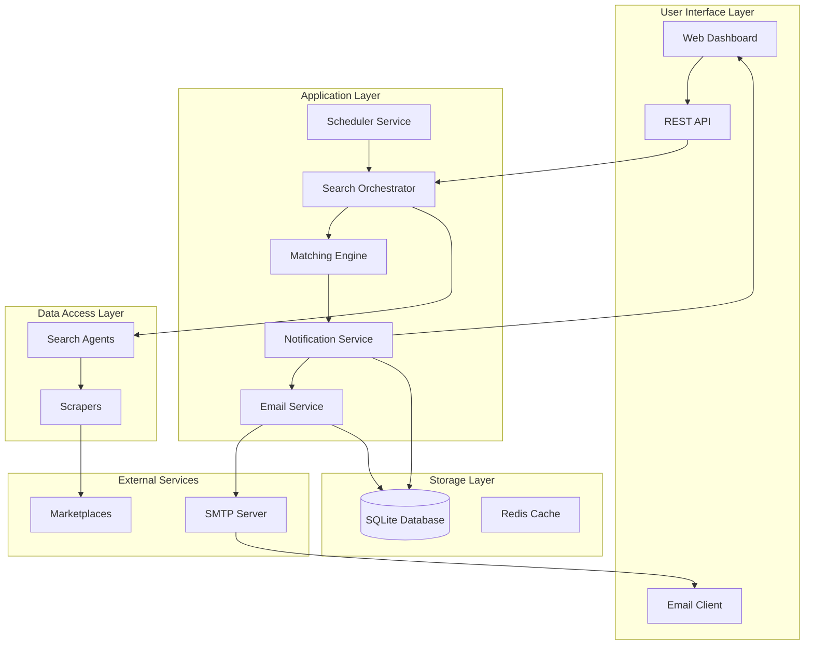
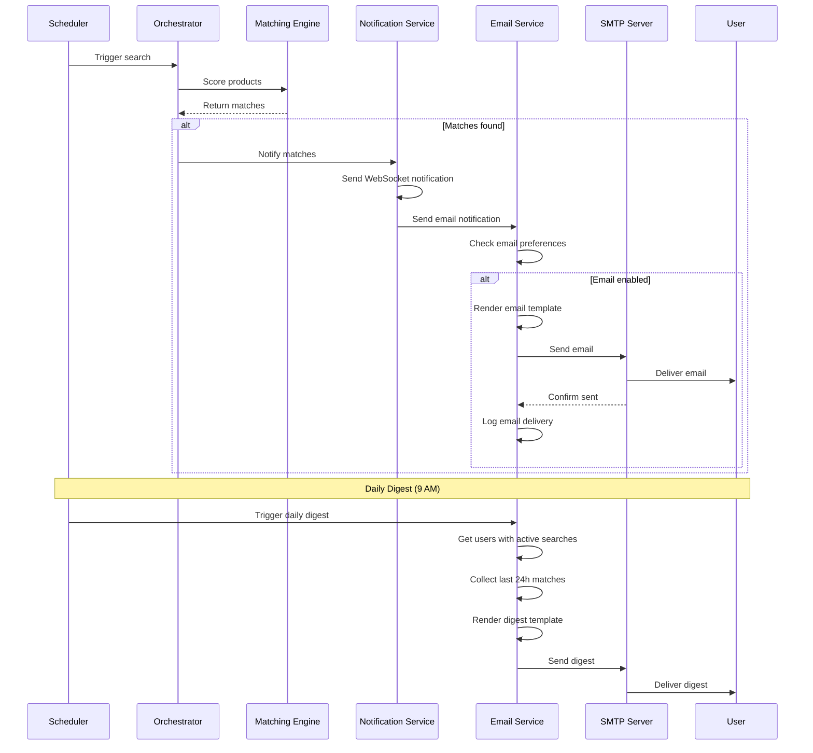

# Email Notification System - Design & Implementation

## Overview

This document extends the Product Search Agent architecture to include email notifications in addition to the web dashboard. Users will receive email alerts when matches are found, providing an additional channel for staying informed about new product listings.

---

## Email Notification Features

### Core Capabilities

1. **Match Notifications**: Email sent immediately when a product match is found
2. **Daily Digest**: Optional summary of all matches found in the last 24 hours
3. **Search Status Updates**: Notifications for search start, completion, and errors
4. **Configurable Preferences**: Users can customize which emails they receive
5. **Rich HTML Emails**: Beautiful, mobile-responsive email templates

---

## Architecture Updates

### Updated System Architecture



---

## Technology Stack for Email

| Component | Technology | Purpose |
|-----------|-----------|---------|
| **Email Library** | aiosmtplib | Async SMTP client for Python |
| **Template Engine** | Jinja2 | HTML email templates |
| **Email Validation** | email-validator | Validate email addresses |
| **HTML/CSS** | MJML | Responsive email markup |
| **SMTP Provider** | Gmail (free) | Free SMTP server (500 emails/day) |
| **Alternative** | SendGrid (free) | 100 emails/day, no SMTP needed |
| **Fallback** | Mailgun (free) | 5,000 emails/month |

---

## Email Service Implementation

### Email Service Class

```python
# backend/app/services/email_service.py

import aiosmtplib
from email.mime.text import MIMEText
from email.mime.multipart import MIMEMultipart
from jinja2 import Environment, FileSystemLoader
from typing import List, Optional
from datetime import datetime
from ..models.product import Product
from ..models.search_request import SearchRequest
from ..config import settings
import logging

logger = logging.getLogger(__name__)

class EmailService:
    """
    Service for sending email notifications.
    
    Supports:
    - Match notifications
    - Daily digests
    - Search status updates
    - Error notifications
    """
    
    def __init__(self):
        self.smtp_host = settings.EMAIL_SMTP_HOST
        self.smtp_port = settings.EMAIL_SMTP_PORT
        self.smtp_username = settings.EMAIL_USERNAME
        self.smtp_password = settings.EMAIL_PASSWORD
        self.from_email = settings.EMAIL_FROM
        self.enabled = settings.ENABLE_EMAIL_NOTIFICATIONS
        
        # Initialize Jinja2 template environment
        self.template_env = Environment(
            loader=FileSystemLoader("app/templates/emails")
        )
    
    async def send_match_notification(
        self,
        to_email: str,
        search_request: SearchRequest,
        products: List[Product]
    ) -> bool:
        """
        Send email notification when matches are found.
        
        Args:
            to_email: Recipient email address
            search_request: The search request that found matches
            products: List of matched products
            
        Returns:
            True if email sent successfully, False otherwise
        """
        if not self.enabled:
            logger.info("Email notifications disabled")
            return False
        
        try:
            # Render email template
            template = self.template_env.get_template("match_notification.html")
            html_content = template.render(
                search_request=search_request,
                products=products,
                match_count=len(products),
                timestamp=datetime.utcnow()
            )
            
            # Create email message
            subject = f"🎯 {len(products)} New Match{'es' if len(products) > 1 else ''} Found: {search_request.product_name}"
            
            await self._send_email(
                to_email=to_email,
                subject=subject,
                html_content=html_content
            )
            
            logger.info(f"Match notification sent to {to_email}")
            return True
            
        except Exception as e:
            logger.error(f"Failed to send match notification: {e}")
            return False
    
    async def send_daily_digest(
        self,
        to_email: str,
        search_requests: List[SearchRequest],
        matches_by_search: dict
    ) -> bool:
        """
        Send daily digest of all matches found in the last 24 hours.
        
        Args:
            to_email: Recipient email address
            search_requests: List of active search requests
            matches_by_search: Dictionary mapping search_id to list of products
            
        Returns:
            True if email sent successfully, False otherwise
        """
        if not self.enabled:
            return False
        
        try:
            total_matches = sum(len(matches) for matches in matches_by_search.values())
            
            if total_matches == 0:
                logger.info("No matches for daily digest, skipping email")
                return False
            
            template = self.template_env.get_template("daily_digest.html")
            html_content = template.render(
                search_requests=search_requests,
                matches_by_search=matches_by_search,
                total_matches=total_matches,
                date=datetime.utcnow().strftime("%B %d, %Y")
            )
            
            subject = f"📊 Daily Digest: {total_matches} New Match{'es' if total_matches > 1 else ''} Found"
            
            await self._send_email(
                to_email=to_email,
                subject=subject,
                html_content=html_content
            )
            
            logger.info(f"Daily digest sent to {to_email}")
            return True
            
        except Exception as e:
            logger.error(f"Failed to send daily digest: {e}")
            return False
    
    async def send_search_started(
        self,
        to_email: str,
        search_request: SearchRequest
    ) -> bool:
        """Send notification when a search starts."""
        if not self.enabled:
            return False
        
        try:
            template = self.template_env.get_template("search_started.html")
            html_content = template.render(
                search_request=search_request,
                timestamp=datetime.utcnow()
            )
            
            subject = f"🔍 Search Started: {search_request.product_name}"
            
            await self._send_email(
                to_email=to_email,
                subject=subject,
                html_content=html_content
            )
            
            return True
            
        except Exception as e:
            logger.error(f"Failed to send search started notification: {e}")
            return False
    
    async def send_error_notification(
        self,
        to_email: str,
        search_request: SearchRequest,
        error_message: str
    ) -> bool:
        """Send notification when a search encounters an error."""
        if not self.enabled:
            return False
        
        try:
            template = self.template_env.get_template("error_notification.html")
            html_content = template.render(
                search_request=search_request,
                error_message=error_message,
                timestamp=datetime.utcnow()
            )
            
            subject = f"⚠️ Search Error: {search_request.product_name}"
            
            await self._send_email(
                to_email=to_email,
                subject=subject,
                html_content=html_content
            )
            
            return True
            
        except Exception as e:
            logger.error(f"Failed to send error notification: {e}")
            return False
    
    async def _send_email(
        self,
        to_email: str,
        subject: str,
        html_content: str,
        text_content: Optional[str] = None
    ) -> None:
        """
        Internal method to send email via SMTP.
        
        Args:
            to_email: Recipient email address
            subject: Email subject
            html_content: HTML email body
            text_content: Plain text fallback (optional)
        """
        # Create message
        message = MIMEMultipart("alternative")
        message["From"] = self.from_email
        message["To"] = to_email
        message["Subject"] = subject
        
        # Add plain text version (fallback)
        if text_content:
            text_part = MIMEText(text_content, "plain")
            message.attach(text_part)
        
        # Add HTML version
        html_part = MIMEText(html_content, "html")
        message.attach(html_part)
        
        # Send email
        async with aiosmtplib.SMTP(
            hostname=self.smtp_host,
            port=self.smtp_port,
            use_tls=True
        ) as smtp:
            await smtp.login(self.smtp_username, self.smtp_password)
            await smtp.send_message(message)
    
    def test_connection(self) -> bool:
        """Test SMTP connection."""
        try:
            import asyncio
            
            async def test():
                async with aiosmtplib.SMTP(
                    hostname=self.smtp_host,
                    port=self.smtp_port,
                    use_tls=True
                ) as smtp:
                    await smtp.login(self.smtp_username, self.smtp_password)
                    return True
            
            return asyncio.run(test())
            
        except Exception as e:
            logger.error(f"SMTP connection test failed: {e}")
            return False
```

---

## Email Templates

### 1. Match Notification Template

```html
<!-- backend/app/templates/emails/match_notification.html -->

<!DOCTYPE html>
<html>
<head>
    <meta charset="UTF-8">
    <meta name="viewport" content="width=device-width, initial-scale=1.0">
    <title>New Matches Found</title>
    <style>
        body {
            font-family: -apple-system, BlinkMacSystemFont, 'Segoe UI', Roboto, 'Helvetica Neue', Arial, sans-serif;
            line-height: 1.6;
            color: #333;
            max-width: 600px;
            margin: 0 auto;
            padding: 20px;
            background-color: #f5f5f5;
        }
        .container {
            background-color: white;
            border-radius: 8px;
            padding: 30px;
            box-shadow: 0 2px 4px rgba(0,0,0,0.1);
        }
        .header {
            text-align: center;
            margin-bottom: 30px;
        }
        .header h1 {
            color: #2563eb;
            margin: 0;
            font-size: 24px;
        }
        .search-info {
            background-color: #f8fafc;
            border-left: 4px solid #2563eb;
            padding: 15px;
            margin-bottom: 30px;
            border-radius: 4px;
        }
        .search-info h2 {
            margin: 0 0 10px 0;
            font-size: 18px;
            color: #1e293b;
        }
        .search-info p {
            margin: 5px 0;
            color: #64748b;
        }
        .product-card {
            border: 1px solid #e2e8f0;
            border-radius: 8px;
            padding: 20px;
            margin-bottom: 20px;
            transition: box-shadow 0.3s;
        }
        .product-card:hover {
            box-shadow: 0 4px 6px rgba(0,0,0,0.1);
        }
        .product-header {
            display: flex;
            justify-content: space-between;
            align-items: start;
            margin-bottom: 15px;
        }
        .product-title {
            font-size: 18px;
            font-weight: 600;
            color: #1e293b;
            margin: 0;
        }
        .product-price {
            font-size: 24px;
            font-weight: 700;
            color: #16a34a;
            margin: 0;
        }
        .product-details {
            color: #64748b;
            margin-bottom: 15px;
        }
        .product-meta {
            display: flex;
            gap: 15px;
            margin-bottom: 15px;
            font-size: 14px;
        }
        .meta-item {
            display: flex;
            align-items: center;
            gap: 5px;
            color: #64748b;
        }
        .match-score {
            display: inline-block;
            background-color: #dcfce7;
            color: #166534;
            padding: 4px 12px;
            border-radius: 12px;
            font-size: 14px;
            font-weight: 600;
        }
        .btn {
            display: inline-block;
            background-color: #2563eb;
            color: white;
            padding: 12px 24px;
            text-decoration: none;
            border-radius: 6px;
            font-weight: 600;
            text-align: center;
        }
        .btn:hover {
            background-color: #1d4ed8;
        }
        .footer {
            text-align: center;
            margin-top: 30px;
            padding-top: 20px;
            border-top: 1px solid #e2e8f0;
            color: #64748b;
            font-size: 14px;
        }
        .footer a {
            color: #2563eb;
            text-decoration: none;
        }
    </style>
</head>
<body>
    <div class="container">
        <div class="header">
            <h1>🎯 New Matches Found!</h1>
            <p style="color: #64748b; margin: 10px 0 0 0;">
                {{ match_count }} product{{ 's' if match_count > 1 else '' }} matching your search
            </p>
        </div>

        <div class="search-info">
            <h2>{{ search_request.product_name }}</h2>
            <p><strong>Description:</strong> {{ search_request.product_description }}</p>
            <p><strong>Budget:</strong> ${{ search_request.budget }}</p>
            
            <p><strong>Location:</strong> {{ search_request.location }}</p>
            
        </div>

        
        <div class="product-card">
            <div class="product-header">
                <h3 class="product-title">{{ product.title }}</h3>
                <p class="product-price">${{ product.price }}</p>
            </div>

            
            <p class="product-details">{{ product.description[:200] }}...</p>
            

            <div class="product-meta">
                <span class="meta-item">
                    📍 {{ product.location or 'Location not specified' }}
                </span>
                <span class="meta-item">
                    🏪 {{ product.platform|title }}
                </span>
                
                <span class="match-score">
                    {{ product.match_score|round(1) }}% Match
                </span>
                
            </div>

            <a href="{{ product.url }}" class="btn">View Product →</a>
        </div>
        

        <div class="footer">
            <p>
                You're receiving this email because you have an active search request.<br>
                <a href="{{ dashboard_url }}">Manage your searches</a> | 
                <a href="{{ settings_url }}">Email preferences</a>
            </p>
            <p style="margin-top: 10px; font-size: 12px;">
                Product Search Agent • {{ timestamp.strftime('%B %d, %Y at %I:%M %p UTC') }}
            </p>
        </div>
    </div>
</body>
</html>
```

### 2. Daily Digest Template

```html
<!-- backend/app/templates/emails/daily_digest.html -->

<!DOCTYPE html>
<html>
<head>
    <meta charset="UTF-8">
    <meta name="viewport" content="width=device-width, initial-scale=1.0">
    <title>Daily Digest</title>
    <style>
        /* Same base styles as match_notification.html */
        body {
            font-family: -apple-system, BlinkMacSystemFont, 'Segoe UI', Roboto, sans-serif;
            line-height: 1.6;
            color: #333;
            max-width: 600px;
            margin: 0 auto;
            padding: 20px;
            background-color: #f5f5f5;
        }
        .container {
            background-color: white;
            border-radius: 8px;
            padding: 30px;
            box-shadow: 0 2px 4px rgba(0,0,0,0.1);
        }
        .header {
            text-align: center;
            margin-bottom: 30px;
        }
        .stats {
            display: flex;
            justify-content: space-around;
            margin-bottom: 30px;
        }
        .stat-card {
            text-align: center;
            padding: 20px;
            background-color: #f8fafc;
            border-radius: 8px;
            flex: 1;
            margin: 0 10px;
        }
        .stat-number {
            font-size: 36px;
            font-weight: 700;
            color: #2563eb;
            margin: 0;
        }
        .stat-label {
            color: #64748b;
            font-size: 14px;
            margin: 5px 0 0 0;
        }
        .search-section {
            margin-bottom: 30px;
        }
        .search-section h3 {
            color: #1e293b;
            border-bottom: 2px solid #e2e8f0;
            padding-bottom: 10px;
        }
        /* Additional styles... */
    </style>
</head>
<body>
    <div class="container">
        <div class="header">
            <h1>📊 Daily Digest</h1>
            <p style="color: #64748b;">{{ date }}</p>
        </div>

        <div class="stats">
            <div class="stat-card">
                <p class="stat-number">{{ total_matches }}</p>
                <p class="stat-label">New Matches</p>
            </div>
            <div class="stat-card">
                <p class="stat-number">{{ search_requests|length }}</p>
                <p class="stat-label">Active Searches</p>
            </div>
        </div>

        
        
        
        <div class="search-section">
            <h3>{{ search_request.product_name }}</h3>
            <p style="color: #64748b; margin-bottom: 20px;">
                {{ matches|length }} new match{{ 'es' if matches|length > 1 else '' }} found
            </p>

            
            <!-- Product card (simplified version) -->
            <div style="border-left: 3px solid #2563eb; padding-left: 15px; margin-bottom: 15px;">
                <strong>{{ product.title }}</strong><br>
                <span style="color: #16a34a; font-weight: 600;">${{ product.price }}</span> • 
                <span style="color: #64748b;">{{ product.platform|title }}</span><br>
                <a href="{{ product.url }}" style="color: #2563eb;">View →</a>
            </div>
            

            
            <p style="text-align: center; color: #64748b;">
                + {{ matches|length - 5 }} more match{{ 'es' if (matches|length - 5) > 1 else '' }}
            </p>
            
        </div>
        
        

        <div style="text-align: center; margin-top: 30px;">
            <a href="{{ dashboard_url }}" style="display: inline-block; background-color: #2563eb; color: white; padding: 12px 24px; text-decoration: none; border-radius: 6px; font-weight: 600;">
                View All Matches →
            </a>
        </div>

        <div class="footer">
            <p>
                <a href="{{ settings_url }}">Email preferences</a> | 
                <a href="{{ unsubscribe_url }}">Unsubscribe from daily digests</a>
            </p>
        </div>
    </div>
</body>
</html>
```

---

## Database Schema Updates

### Add Email Preferences Table

```sql
-- User email preferences
CREATE TABLE email_preferences (
    id TEXT PRIMARY KEY,
    email TEXT NOT NULL UNIQUE,
    enable_match_notifications BOOLEAN DEFAULT TRUE,
    enable_daily_digest BOOLEAN DEFAULT TRUE,
    enable_search_status BOOLEAN DEFAULT FALSE,
    enable_error_notifications BOOLEAN DEFAULT TRUE,
    digest_time TEXT DEFAULT '09:00',  -- Time to send daily digest (HH:MM)
    created_at TIMESTAMP DEFAULT CURRENT_TIMESTAMP,
    updated_at TIMESTAMP DEFAULT CURRENT_TIMESTAMP
);

-- Link search requests to email addresses
ALTER TABLE search_requests ADD COLUMN user_email TEXT;

-- Email delivery log
CREATE TABLE email_log (
    id TEXT PRIMARY KEY,
    to_email TEXT NOT NULL,
    subject TEXT NOT NULL,
    email_type TEXT NOT NULL,  -- 'match', 'digest', 'status', 'error'
    sent_at TIMESTAMP DEFAULT CURRENT_TIMESTAMP,
    success BOOLEAN DEFAULT TRUE,
    error_message TEXT,
    search_request_id TEXT,
    FOREIGN KEY (search_request_id) REFERENCES search_requests(id)
);

CREATE INDEX idx_email_log_sent_at ON email_log(sent_at DESC);
CREATE INDEX idx_email_log_email ON email_log(to_email);
```

---

## Configuration Updates

### Updated Environment Variables

```bash
# Email Configuration
ENABLE_EMAIL_NOTIFICATIONS=true
EMAIL_SMTP_HOST=smtp.gmail.com
EMAIL_SMTP_PORT=587
EMAIL_USERNAME=your-email@gmail.com
EMAIL_PASSWORD=your-app-password
EMAIL_FROM=Product Search Agent <noreply@yourdomain.com>

# Email Features
ENABLE_DAILY_DIGEST=true
DAILY_DIGEST_TIME=09:00
MAX_PRODUCTS_PER_EMAIL=10

# Rate Limiting
EMAIL_RATE_LIMIT_PER_HOUR=50
```

### Gmail Setup Instructions

```markdown
## Setting Up Gmail for Email Notifications

1. **Enable 2-Factor Authentication**
   - Go to Google Account settings
   - Security → 2-Step Verification
   - Enable 2FA

2. **Generate App Password**
   - Go to Security → App passwords
   - Select "Mail" and "Other (Custom name)"
   - Name it "Product Search Agent"
   - Copy the 16-character password

3. **Configure Environment Variables**
   ```bash
   EMAIL_SMTP_HOST=smtp.gmail.com
   EMAIL_SMTP_PORT=587
   EMAIL_USERNAME=your-email@gmail.com
   EMAIL_PASSWORD=your-16-char-app-password
   ```

4. **Limitations**
   - 500 emails per day (free Gmail)
   - 2000 emails per day (Google Workspace)
```

---

## API Endpoints Updates

### Email Preferences Endpoints

```python
# New endpoints for email preferences

POST   /api/email-preferences          Create/update email preferences
GET    /api/email-preferences/{email}  Get email preferences
PUT    /api/email-preferences/{email}  Update email preferences
DELETE /api/email-preferences/{email}  Delete email preferences (unsubscribe)

# Example request
POST /api/email-preferences
{
    "email": "user@example.com",
    "enable_match_notifications": true,
    "enable_daily_digest": true,
    "enable_search_status": false,
    "enable_error_notifications": true,
    "digest_time": "09:00"
}
```

---

## Integration with Notification Service

### Updated Notification Service

```python
# backend/app/core/notification_service.py

from .email_service import EmailService

class NotificationService:
    def __init__(self):
        self.email_service = EmailService()
        self.websocket_connections = {}
    
    async def notify_match_found(
        self,
        search_request: SearchRequest,
        products: List[Product]
    ):
        """Send notifications via both WebSocket and Email."""
        
        # Send WebSocket notification (existing)
        await self._send_websocket_notification({
            "type": "match_found",
            "search_request_id": search_request.id,
            "products": [p.dict() for p in products]
        })
        
        # Send Email notification (new)
        if search_request.user_email:
            preferences = await self._get_email_preferences(search_request.user_email)
            
            if preferences and preferences.enable_match_notifications:
                await self.email_service.send_match_notification(
                    to_email=search_request.user_email,
                    search_request=search_request,
                    products=products
                )
```

---

## Daily Digest Scheduler

### Scheduled Task for Daily Digest

```python
# backend/app/core/scheduler.py

from apscheduler.schedulers.asyncio import AsyncIOScheduler
from apscheduler.triggers.cron import CronTrigger

class SchedulerService:
    def __init__(self):
        self.scheduler = AsyncIOScheduler()
        self.email_service = EmailService()
    
    def start(self):
        # Existing: Search every 2 hours
        self.scheduler.add_job(
            self.execute_searches,
            'interval',
            hours=2,
            id='search_job'
        )
        
        # New: Daily digest at 9 AM
        self.scheduler.add_job(
            self.send_daily_digests,
            CronTrigger(hour=9, minute=0),
            id='daily_digest_job'
        )
        
        self.scheduler.start()
    
    async def send_daily_digests(self):
        """Send daily digest to all users with active searches."""
        
        # Get all unique email addresses with active searches
        emails = await self.db.get_active_user_emails()
        
        for email in emails:
            try:
                # Get user's preferences
                preferences = await self.db.get_email_preferences(email)
                
                if not preferences or not preferences.enable_daily_digest:
                    continue
                
                # Get user's search requests
                search_requests = await self.db.get_search_requests_by_email(email)
                
                # Get matches from last 24 hours
                matches_by_search = {}
                for search in search_requests:
                    matches = await self.db.get_recent_matches(
                        search_request_id=search.id,
                        hours=24
                    )
                    if matches:
                        matches_by_search[search.id] = matches
                
                # Send digest if there are matches
                if matches_by_search:
                    await self.email_service.send_daily_digest(
                        to_email=email,
                        search_requests=search_requests,
                        matches_by_search=matches_by_search
                    )
                    
            except Exception as e:
                logger.error(f"Failed to send daily digest to {email}: {e}")
```

---

## Testing Email Functionality

### Test Email Service

```python
# backend/app/tests/test_email_service.py

import pytest
from app.services.email_service import EmailService
from app.models.search_request import SearchRequest
from app.models.product import Product

@pytest.mark.asyncio
async def test_send_match_notification():
    email_service = EmailService()
    
    search_request = SearchRequest(
        product_name="Toyota Camry",
        product_description="2015 model",
        budget=6000,
        user_email="test@example.com"
    )
    
    products = [
        Product(
            title="2015 Toyota Camry LE",
            price=5500,
            url="https://example.com/product/1",
            platform="craigslist",
            match_score=85.5
        )
    ]
    
    result = await email_service.send_match_notification(
        to_email="test@example.com",
        search_request=search_request,
        products=products
    )
    
    assert result == True

@pytest.mark.asyncio
async def test_smtp_connection():
    email_service = EmailService()
    assert email_service.test_connection() == True
```

---

## Email Notification Workflow



---

## Alternative Email Providers

### SendGrid (Free Tier)

```python
# Using SendGrid API (no SMTP needed)

import httpx
from sendgrid import SendGridAPIClient
from sendgrid.helpers.mail import Mail

class SendGridEmailService:
    def __init__(self):
        self.api_key = settings.SENDGRID_API_KEY
        self.client = SendGridAPIClient(self.api_key)
    
    async def send_email(self, to_email, subject, html_content):
        message = Mail(
            from_email=settings.EMAIL_FROM,
            to_emails=to_email,
            subject=subject,
            html_content=html_content
        )
        
        try:
            response = self.client.send(message)
            return response.status_code == 202
        except Exception as e:
            logger.error(f"SendGrid error: {e}")
            return False
```

**Pros:**
- 100 emails/day free
- No SMTP configuration
- Better deliverability
- Email analytics

**Cons:**
- Requires API key
- Lower free tier limit

---

## Summary

The email notification system adds a powerful communication channel to the Product Search Agent:

✅ **Instant Notifications**: Get emails immediately when matches are found  
✅ **Daily Digests**: Optional summary of all matches  
✅ **Configurable**: Users control which emails they receive  
✅ **Beautiful Templates**: Mobile-responsive HTML emails  
✅ **Free**: Use Gmail (500/day) or SendGrid (100/day)  
✅ **Reliable**: Async sending with error handling and logging  

**Next Steps:**
1. Set up Gmail app password or SendGrid account
2. Implement email service and templates
3. Add email preferences to user settings
4. Test email delivery
5. Deploy with email notifications enabled