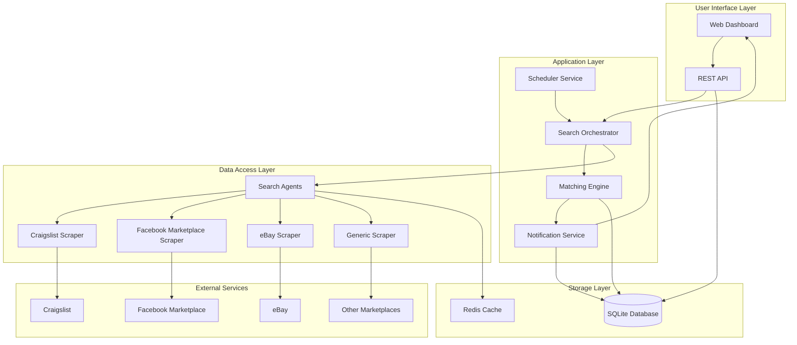
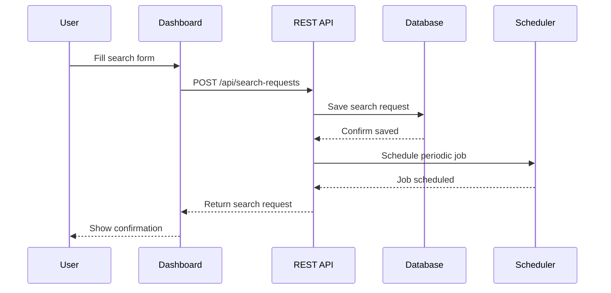
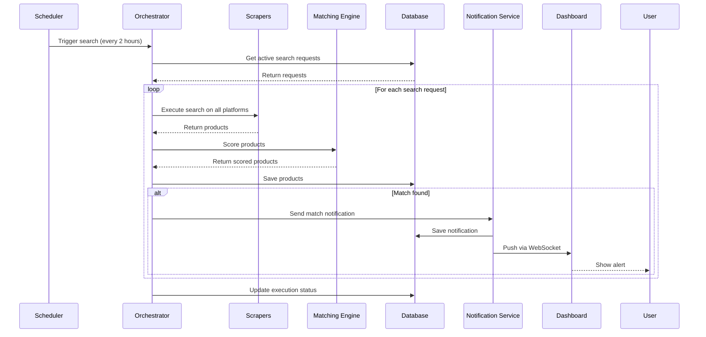
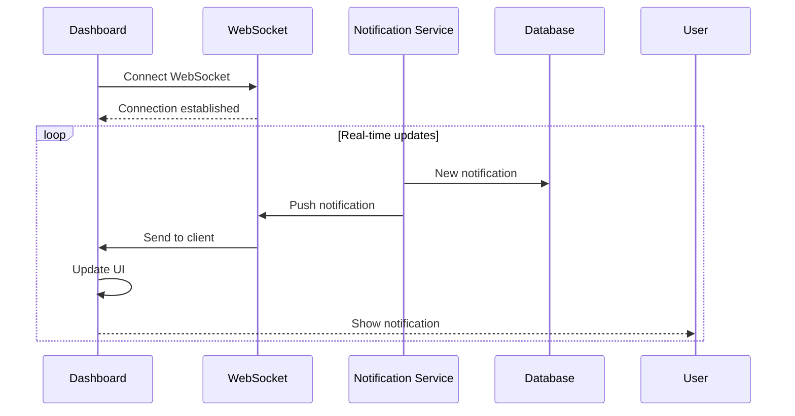

# Agentic Product Search System - Architecture & Design

## Executive Summary

This document outlines the architecture for an autonomous product search agent that monitors multiple online marketplaces, matches products against user criteria, and provides real-time notifications through a web dashboard.

**Key Features:**
- Automated search every 2 hours
- Multi-platform web scraping (Craigslist, Facebook Marketplace, eBay, etc.)
- Intelligent matching with configurable thresholds
- Real-time web dashboard
- Free and open-source technology stack
- Cloud deployment on free tier

---

## System Architecture

### High-Level Architecture
### High-Level Architecture
### High-Level Architecture



---

## Technology Stack

### Core Technologies (All Free & Open Source)

| Component | Technology | Purpose |
|-----------|-----------|---------|
| **Backend Framework** | FastAPI | High-performance REST API |
| **Task Scheduler** | APScheduler | Periodic search execution |
| **Web Scraping** | BeautifulSoup4 + Selenium | HTML parsing and dynamic content |
| **HTTP Client** | httpx / requests | API calls and web requests |
| **Database** | SQLite | Lightweight persistent storage |
| **Cache** | Redis (optional) | Rate limiting and caching |
| **Frontend** | React + Vite | Modern web dashboard |
| **WebSocket** | FastAPI WebSocket | Real-time updates |
| **Text Matching** | FuzzyWuzzy / RapidFuzz | Similarity scoring |
| **NLP** | spaCy (small model) | Description analysis |
| **Deployment** | Render / Railway / Fly.io | Free cloud hosting |
| **Process Manager** | systemd / PM2 | Service management |

### Why These Technologies?

1. **FastAPI**: Async support, automatic API docs, WebSocket support
2. **APScheduler**: Reliable job scheduling with persistence
3. **BeautifulSoup4**: Simple HTML parsing for static content
4. **Selenium**: Handles JavaScript-heavy sites (Facebook Marketplace)
5. **SQLite**: No server needed, perfect for small-to-medium datasets
6. **FuzzyWuzzy**: Excellent string matching for product descriptions
7. **React**: Component-based UI, real-time updates via WebSocket

---

## Component Design

### 1. Search Orchestrator

**Responsibilities:**
- Coordinate search operations across multiple platforms
- Manage search job lifecycle
- Handle errors and retries
- Aggregate results from all scrapers

**Key Methods:**
```python
class SearchOrchestrator:
    async def execute_search(search_request_id: str)
    async def distribute_to_scrapers(search_params: dict)
    async def collect_results()
    async def handle_scraper_failure(scraper_name: str, error: Exception)
```

### 2. Scheduler Service

**Responsibilities:**
- Execute searches every 2 hours
- Manage active and paused search requests
- Persist schedule state
- Handle system restarts

**Configuration:**
```python
SCHEDULER_CONFIG = {
    'interval_hours': 2,
    'max_concurrent_searches': 5,
    'retry_on_failure': True,
    'max_retries': 3
}
```

### 3. Matching Engine

**Responsibilities:**
- Score product matches against criteria
- Apply configurable thresholds
- Rank results by relevance
- Filter duplicates

**Matching Algorithm:**
```python
def calculate_match_score(product, criteria):
    # 1. Budget check (hard constraint)
    if product.price > criteria.budget:
        return 0
    
    # 2. Title similarity (40% weight)
    title_score = fuzzy_ratio(product.title, criteria.product_name)
    
    # 3. Description similarity (40% weight)
    desc_score = fuzzy_ratio(product.description, criteria.description)
    
    # 4. Price attractiveness (20% weight)
    price_score = (criteria.budget - product.price) / criteria.budget * 100
    
    # Final score
    return (title_score * 0.4) + (desc_score * 0.4) + (price_score * 0.2)
```

### 4. Web Scrapers

Each scraper implements a common interface:

```python
class BaseScraper(ABC):
    @abstractmethod
    async def search(self, query: str, max_price: float, location: str) -> List[Product]
    
    @abstractmethod
    async def get_product_details(self, url: str) -> Product
    
    @abstractmethod
    def is_available(self) -> bool
```

**Scraper Implementations:**

#### Craigslist Scraper
- Uses BeautifulSoup4 (static HTML)
- RSS feed support for recent listings
- Location-based search
- No authentication required

#### Facebook Marketplace Scraper
- Uses Selenium (JavaScript-heavy)
- Requires headless browser
- Location-based search
- Rate limiting considerations

#### eBay Scraper
- Uses BeautifulSoup4
- Supports auction and Buy It Now
- Advanced search filters
- No API key needed (web scraping)

#### Generic Scraper
- Configurable for other sites
- CSS selector-based extraction
- Fallback for unknown platforms

### 5. Notification Service

**Responsibilities:**
- Push real-time updates to dashboard
- Store notification history
- Handle WebSocket connections
- Email notifications (optional)

**Notification Types:**
```python
class NotificationType(Enum):
    MATCH_FOUND = "match_found"
    SEARCH_STARTED = "search_started"
    SEARCH_COMPLETED = "search_completed"
    ERROR_OCCURRED = "error_occurred"
```

### 6. Web Dashboard

**Features:**
- Create/edit/delete search requests
- View active searches and their status
- Real-time match notifications
- Match history with filtering
- Configure matching thresholds
- Pause/resume searches

**Dashboard Sections:**
1. **Active Searches**: List of ongoing searches with status
2. **Recent Matches**: Latest products found
3. **Search History**: Past search executions
4. **Settings**: Configure thresholds and preferences

---

## Data Models

### Database Schema

```sql
-- Search Requests
CREATE TABLE search_requests (
    id TEXT PRIMARY KEY,
    product_name TEXT NOT NULL,
    product_description TEXT NOT NULL,
    budget REAL NOT NULL,
    location TEXT,
    match_threshold REAL DEFAULT 70.0,
    status TEXT DEFAULT 'active',
    created_at TIMESTAMP DEFAULT CURRENT_TIMESTAMP,
    updated_at TIMESTAMP DEFAULT CURRENT_TIMESTAMP
);

-- Search Executions
CREATE TABLE search_executions (
    id TEXT PRIMARY KEY,
    search_request_id TEXT NOT NULL,
    started_at TIMESTAMP NOT NULL,
    completed_at TIMESTAMP,
    status TEXT DEFAULT 'running',
    products_found INTEGER DEFAULT 0,
    matches_found INTEGER DEFAULT 0,
    error_message TEXT,
    FOREIGN KEY (search_request_id) REFERENCES search_requests(id)
);

-- Products Found
CREATE TABLE products (
    id TEXT PRIMARY KEY,
    search_execution_id TEXT NOT NULL,
    title TEXT NOT NULL,
    description TEXT,
    price REAL NOT NULL,
    url TEXT NOT NULL,
    image_url TEXT,
    platform TEXT NOT NULL,
    location TEXT,
    posted_date TIMESTAMP,
    match_score REAL,
    is_match BOOLEAN DEFAULT FALSE,
    created_at TIMESTAMP DEFAULT CURRENT_TIMESTAMP,
    FOREIGN KEY (search_execution_id) REFERENCES search_executions(id)
);

-- Notifications
CREATE TABLE notifications (
    id TEXT PRIMARY KEY,
    search_request_id TEXT NOT NULL,
    product_id TEXT,
    type TEXT NOT NULL,
    message TEXT NOT NULL,
    read BOOLEAN DEFAULT FALSE,
    created_at TIMESTAMP DEFAULT CURRENT_TIMESTAMP,
    FOREIGN KEY (search_request_id) REFERENCES search_requests(id),
    FOREIGN KEY (product_id) REFERENCES products(id)
);

-- Indexes for performance
CREATE INDEX idx_search_requests_status ON search_requests(status);
CREATE INDEX idx_products_match ON products(is_match, match_score DESC);
CREATE INDEX idx_notifications_unread ON notifications(read, created_at DESC);
```

### Python Data Models (Pydantic)

```python
from pydantic import BaseModel, Field
from datetime import datetime
from typing import Optional, List
from enum import Enum

class SearchStatus(str, Enum):
    ACTIVE = "active"
    PAUSED = "paused"
    COMPLETED = "completed"
    CANCELLED = "cancelled"

class SearchRequest(BaseModel):
    id: str = Field(default_factory=lambda: str(uuid.uuid4()))
    product_name: str
    product_description: str
    budget: float
    location: Optional[str] = None
    match_threshold: float = 70.0
    status: SearchStatus = SearchStatus.ACTIVE
    created_at: datetime = Field(default_factory=datetime.utcnow)
    updated_at: datetime = Field(default_factory=datetime.utcnow)

class Product(BaseModel):
    id: str = Field(default_factory=lambda: str(uuid.uuid4()))
    search_execution_id: str
    title: str
    description: Optional[str] = None
    price: float
    url: str
    image_url: Optional[str] = None
    platform: str
    location: Optional[str] = None
    posted_date: Optional[datetime] = None
    match_score: Optional[float] = None
    is_match: bool = False
    created_at: datetime = Field(default_factory=datetime.utcnow)

class SearchExecution(BaseModel):
    id: str = Field(default_factory=lambda: str(uuid.uuid4()))
    search_request_id: str
    started_at: datetime = Field(default_factory=datetime.utcnow)
    completed_at: Optional[datetime] = None
    status: str = "running"
    products_found: int = 0
    matches_found: int = 0
    error_message: Optional[str] = None
```

---

## System Workflows

### Workflow 1: Create Search Request



### Workflow 2: Periodic Search Execution



### Workflow 3: Real-time Dashboard Updates



---

## API Endpoints

### Search Request Management

```
POST   /api/search-requests          Create new search request
GET    /api/search-requests          List all search requests
GET    /api/search-requests/{id}     Get specific search request
PUT    /api/search-requests/{id}     Update search request
DELETE /api/search-requests/{id}     Delete search request
POST   /api/search-requests/{id}/pause   Pause search
POST   /api/search-requests/{id}/resume  Resume search
```

### Search Execution & Results

```
GET    /api/search-executions        List search executions
GET    /api/search-executions/{id}   Get execution details
GET    /api/products                 List all products found
GET    /api/products/matches         List only matched products
GET    /api/products/{id}            Get product details
```

### Notifications

```
GET    /api/notifications            List notifications
PUT    /api/notifications/{id}/read  Mark as read
DELETE /api/notifications/{id}       Delete notification
```

### WebSocket

```
WS     /ws/notifications             Real-time notification stream
```

### System Status

```
GET    /api/health                   System health check
GET    /api/stats                    System statistics
```

---

## Deployment Architecture

### Free Cloud Hosting Options

#### Option 1: Render.com (Recommended)
- **Free Tier**: 750 hours/month
- **Features**: Auto-deploy from Git, persistent disk, custom domains
- **Limitations**: Sleeps after 15 min inactivity (can use cron-job.org to keep alive)

#### Option 2: Railway.app
- **Free Tier**: $5 credit/month
- **Features**: PostgreSQL included, no sleep
- **Limitations**: Credit-based usage

#### Option 3: Fly.io
- **Free Tier**: 3 shared VMs
- **Features**: Global deployment, persistent volumes
- **Limitations**: 160GB bandwidth/month

### Deployment Structure

```
product-search-agent/
├── backend/
│   ├── app/
│   │   ├── main.py              # FastAPI application
│   │   ├── scheduler.py         # APScheduler setup
│   │   ├── orchestrator.py      # Search orchestrator
│   │   ├── scrapers/            # Scraper implementations
│   │   ├── matching.py          # Matching engine
│   │   ├── models.py            # Data models
│   │   └── database.py          # Database operations
│   ├── requirements.txt
│   └── Dockerfile
├── frontend/
│   ├── src/
│   │   ├── components/          # React components
│   │   ├── pages/               # Dashboard pages
│   │   ├── services/            # API client
│   │   └── App.tsx
│   ├── package.json
│   └── vite.config.ts
├── docker-compose.yml
└── README.md
```

### Environment Configuration

```bash
# .env file
DATABASE_URL=sqlite:///./product_search.db
REDIS_URL=redis://localhost:6379
SEARCH_INTERVAL_HOURS=2
MAX_CONCURRENT_SEARCHES=5
MATCH_THRESHOLD_DEFAULT=70.0
ENABLE_EMAIL_NOTIFICATIONS=false
LOG_LEVEL=INFO
```

---

## Implementation Considerations

### Web Scraping Best Practices

1. **Rate Limiting**
   - Implement delays between requests (2-5 seconds)
   - Rotate user agents
   - Respect robots.txt

2. **Error Handling**
   - Retry failed requests (max 3 attempts)
   - Log scraping errors
   - Fallback to alternative scrapers

3. **Anti-Bot Detection**
   - Use realistic user agents
   - Implement random delays
   - Use Selenium with stealth plugins for JavaScript sites

4. **Legal Compliance**
   - Only scrape publicly available data
   - Respect terms of service
   - Don't overload servers

### Performance Optimization

1. **Async Operations**
   - Use asyncio for concurrent scraping
   - Non-blocking database operations
   - Parallel scraper execution

2. **Caching**
   - Cache search results (15 minutes)
   - Cache product details
   - Use Redis for distributed caching

3. **Database Optimization**
   - Index frequently queried columns
   - Implement pagination
   - Archive old search executions

### Security Considerations

1. **Input Validation**
   - Sanitize user inputs
   - Validate URLs before scraping
   - Prevent SQL injection (use parameterized queries)

2. **Rate Limiting**
   - Limit API requests per user
   - Prevent abuse of scraping resources

3. **Data Privacy**
   - Don't store sensitive user data
   - Implement data retention policies
   - GDPR compliance (if applicable)

---

## Monitoring & Maintenance

### Key Metrics to Track

1. **Search Performance**
   - Average search duration
   - Success rate per platform
   - Products found per search
   - Match rate

2. **System Health**
   - API response times
   - Database query performance
   - Scraper failure rates
   - WebSocket connection stability

3. **User Engagement**
   - Active search requests
   - Notification click-through rate
   - Dashboard usage patterns

### Logging Strategy

```python
import logging

# Configure structured logging
logging.basicConfig(
    level=logging.INFO,
    format='%(asctime)s - %(name)s - %(levelname)s - %(message)s'
)

# Log categories
logger.info("Search started", extra={
    "search_id": search_id,
    "platform": "craigslist",
    "query": query
})

logger.error("Scraper failed", extra={
    "scraper": "facebook",
    "error": str(error),
    "retry_count": retry_count
})
```

---

## Scalability Roadmap

### Phase 1: MVP (Weeks 1-2)
- Basic search orchestrator
- Craigslist scraper only
- Simple matching algorithm
- Basic web dashboard
- SQLite database

### Phase 2: Multi-Platform (Weeks 3-4)
- Add Facebook Marketplace scraper
- Add eBay scraper
- Improve matching with NLP
- Enhanced dashboard UI
- WebSocket notifications

### Phase 3: Advanced Features (Weeks 5-6)
- Generic scraper for custom sites
- Email notifications
- Advanced filtering options
- Search history analytics
- Mobile-responsive design

### Phase 4: Optimization (Weeks 7-8)
- Performance tuning
- Caching implementation
- Error recovery improvements
- Deployment automation
- Documentation

---

## Alternative Approaches

### Approach 1: Serverless Architecture
**Pros:**
- Lower costs
- Auto-scaling
- No server management

**Cons:**
- Cold start delays
- Complex scheduling
- Limited execution time

### Approach 2: Microservices
**Pros:**
- Better separation of concerns
- Independent scaling
- Technology flexibility

**Cons:**
- More complex deployment
- Higher resource usage
- Overkill for this use case

### Approach 3: Monolithic (Recommended)
**Pros:**
- Simpler deployment
- Easier debugging
- Lower resource usage
- Perfect for MVP

**Cons:**
- Harder to scale individual components
- Tighter coupling

---

## Cost Analysis (Free Tier)

| Service | Free Tier | Sufficient For |
|---------|-----------|----------------|
| Render.com | 750 hrs/month | Yes (24/7 with keep-alive) |
| Railway.app | $5 credit/month | Yes (light usage) |
| Fly.io | 3 VMs | Yes |
| GitHub | Unlimited public repos | Yes |
| Cloudflare | Free CDN | Yes |

**Total Monthly Cost: $0** (using free tiers)

---

## Risk Mitigation

### Risk 1: Website Structure Changes
**Mitigation:**
- Implement scraper health checks
- Version scrapers
- Fallback to alternative platforms
- Regular maintenance schedule

### Risk 2: Rate Limiting/Blocking
**Mitigation:**
- Implement exponential backoff
- Rotate user agents
- Use proxy rotation (if needed)
- Respect rate limits

### Risk 3: Free Tier Limitations
**Mitigation:**
- Optimize resource usage
- Implement efficient caching
- Use keep-alive services
- Plan for paid tier migration

### Risk 4: Data Quality Issues
**Mitigation:**
- Validate scraped data
- Implement data cleaning
- Handle missing fields gracefully
- Log data quality metrics

---

## Success Criteria

1. **Functional Requirements**
   - ✓ Search executes every 2 hours
   - ✓ Supports multiple platforms
   - ✓ Matches products within budget
   - ✓ Real-time dashboard updates
   - ✓ Configurable matching thresholds

2. **Performance Requirements**
   - Search completes within 5 minutes
   - Dashboard loads in < 2 seconds
   - WebSocket latency < 500ms
   - 95% scraper success rate

3. **Reliability Requirements**
   - 99% uptime
   - Automatic error recovery
   - Data persistence across restarts
   - Graceful degradation

---

## Next Steps

1. Review and approve this architecture
2. Set up development environment
3. Implement Phase 1 (MVP)
4. Test with real search scenarios
5. Deploy to free cloud hosting
6. Iterate based on feedback
